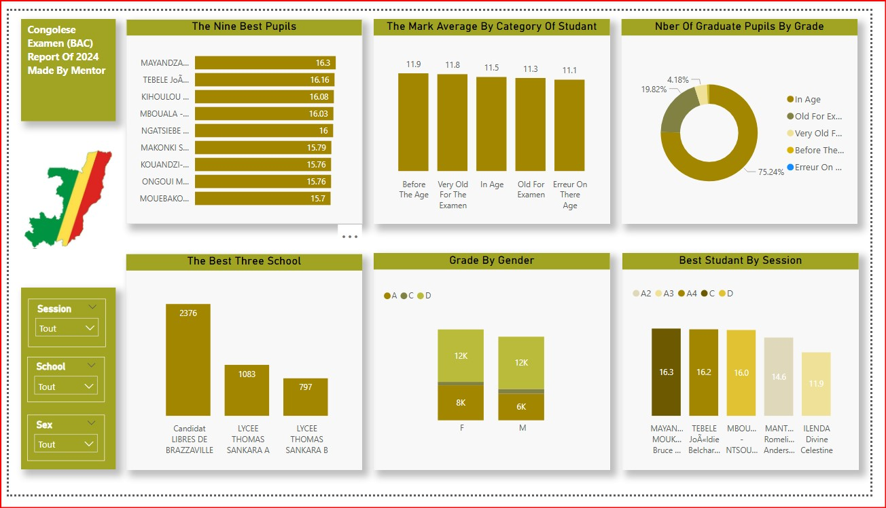
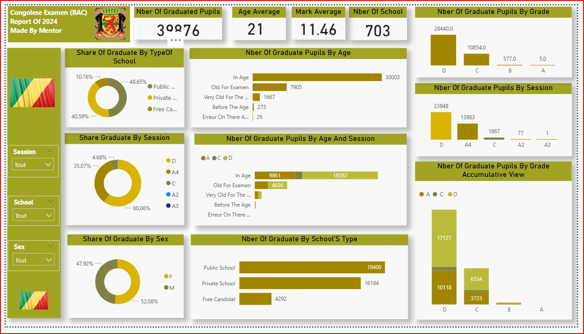

  <a href="README.md" target="_top">
    ⬅️ <b>[Retour au Profil Principal]</b>
  </a>

---

<table border="0" cellpadding="0" cellspacing="0">
  <tr>
    <td valign="middle" width="70">
      
    </td>
    <td valign="middle">
      <h1>Congolese Examen (BAC) Report Of 2024</h1>
    </td>
  </tr>
</table>

> 📊 Ingestion de gros volumes de données, sectorisation macro-éducative et analyse statistique des résultats officiels du Baccalauréat Congolais.

---

## 1️⃣ Introduction du Projet

Ce projet consiste en la modélisation et la conception d'une solution décisionnelle complète sous **Power BI** pour analyser les résultats officiels du **Baccalauréat en République du Congo (Session 2024)**. 

L'objectif principal était de consolider des bases de données étatiques massives afin de fournir une cartographie claire de la réussite scolaire, d'isoler les performances selon le statut des établissements et de dresser un profil démographique rigoureux des bacheliers.

🎯 **Objectif :** Transformer des données publiques brutes en indicateurs stratégiques pour auditer l'efficacité du système éducatif national.

---

## 🎨 Aperçu du Dashboard Déployé

  

 

  

> *Note : Pour l'affichage sur votre dépôt GitHub, assurez-vous de nommer l'image de ce projet `Projet3.jpg` (ou d'utiliser le nom exact du fichier présent dans votre répertoire) et de modifier l'extension si nécessaire.*

---

## 2️⃣ Analyse des Données & Insights Clés

L'exploration visuelle de la donnée à travers l'interface met en évidence des métriques fondamentales :

### 📈 Indicateurs Généraux (KPIs)
*   🎓 **Volume National :** **39 876 élèves diplômés** recensés dans le modèle.
*   🏫 **Infrastructures :** **703 établissements scolaires** analysés et sectorisés.
*   📝 **Niveau Académique :** Une moyenne générale de passage s'élevant à **11.46/20**.
*   ⏳ **Indicateur d'Âge :** Un âge moyen de réussite fixé à **21 ans**.

### 🏢 Répartition par Type d'Établissement
*   🏛️ **Enseignement Public :** Domine le volume avec **19 400 diplômés** (48.65 %).
*   🏢 **Enseignement Privé :** Représente une part majeure de **16 184 diplômés** (40.59 %).
*   👤 **Candidats Libres (Free Candidat) :** Clôturent la marche avec **4 292 bacheliers** (10.76 %).

### 🗂️ Analyse Démographique & Session
*   🚻 **Segmentation par Genre :** Une répartition équilibrée comprenant **52.08 % d'hommes (M)** et **47.92 % de femmes (F)**.
*   📅 **Situation par Tranche d'Âge :** **30 003 candidats** ont obtenu le diplôme "Dans les âges" (*In Age*), tandis que **7 905 bacheliers** sont considérés en surâge (*Old For Examen*).

---

## 3️⃣ Outils & Démarche Technique

| Composant | Utilisation & Compétences Mises en Œuvre |
|-----------|------------------------------------------|
| **Power BI Desktop** | Conception de l'interface utilisateur, du design et du storytelling visuel |
| **Power Query (ETL)** | Ingestion, nettoyage, suppression des doublons et jointures de bases complexes |
| **Langage DAX** | Développement des mesures calculées pour les moyennes pondérées et ratios par mention |
| **Data Modeling** | Architecture relationnelle en étoile (Liaison Établissements ➔ Candidats ➔ Sessions) |

---

## 4️⃣ Solutions & Recommandations Macro-Éducatives

| Points d'Attention Identifiés | Plans d'Actions & Recommandations Proposés |
|-------------------------------|--------------------------------------------|
| ⏳ Âge moyen de 21 ans au BAC | Auditer les goulots d'étranglement et le taux de redoublement dans les cycles précédents pour fluidifier les parcours scolaires. |
| 📈 Concentration des Mentions | Mettre en place des programmes de renforcement pédagogique ciblés pour faire pivoter la masse des mentions "Passable" (D) vers les mentions "Assez Bien" (C) et supérieures. |
| 🤝 Complémentarité Public/Privé | Standardiser les indicateurs de performance clés (KPIs) des complexes privés performants pour les transposer au secteur public. |

---

  <a href="README.md" target="_top">
    🏁 <b>[Retour au Profil Principal]</b>
  </a>

